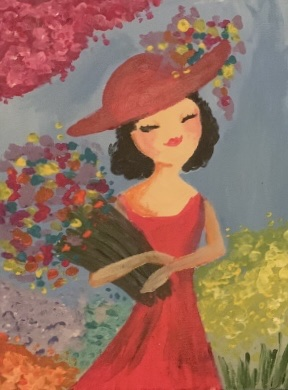
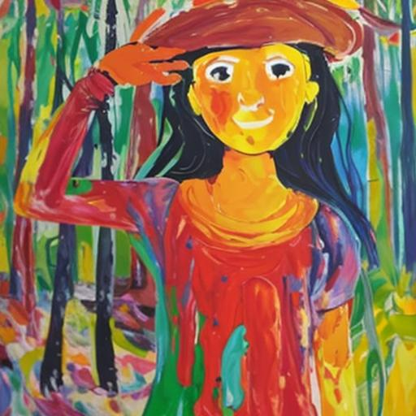
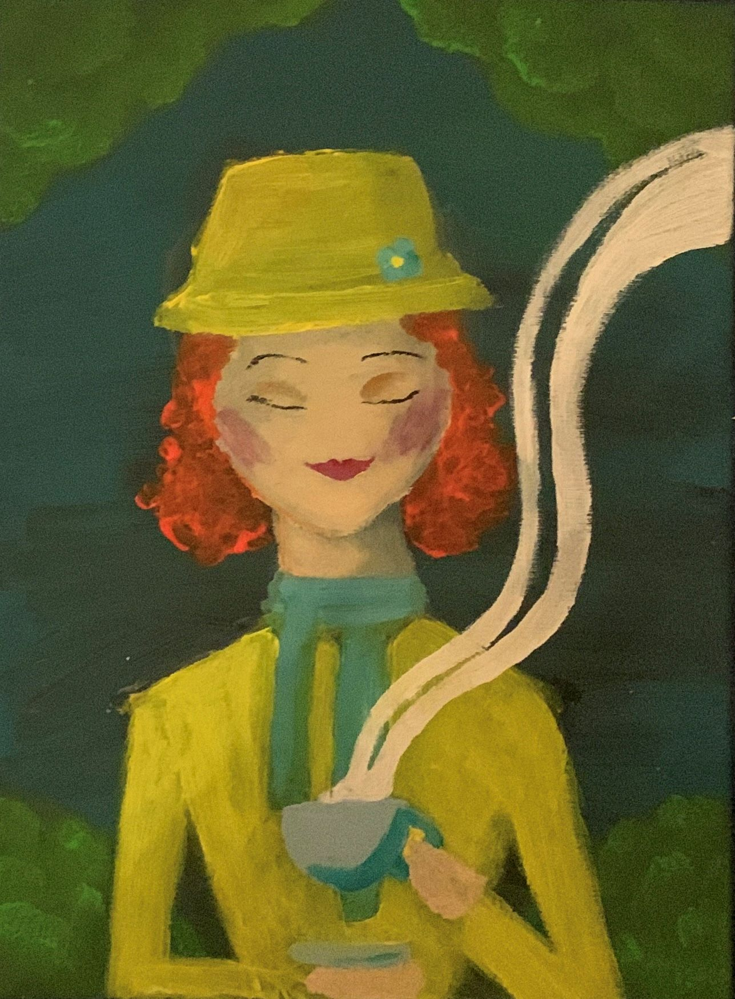
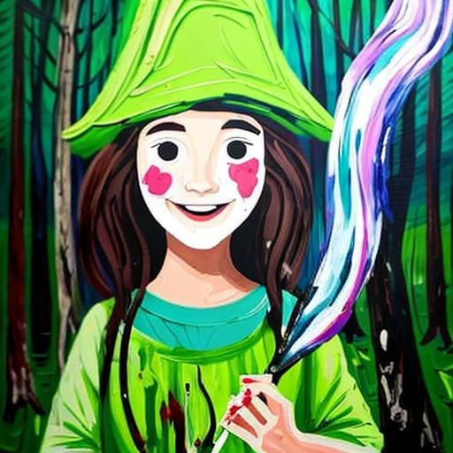
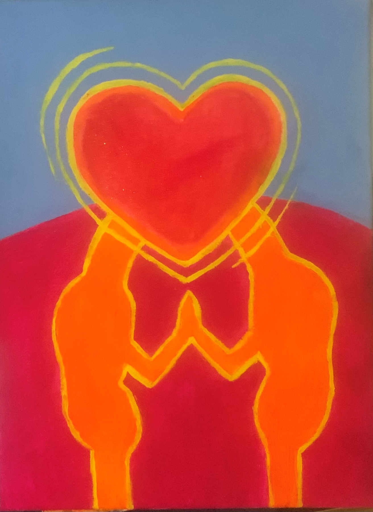
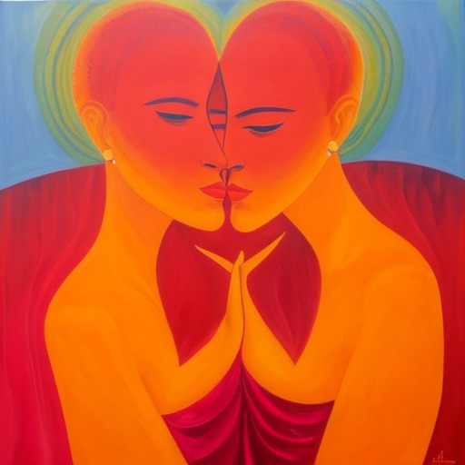

Voor een schoolopdracht ben ik aan het onderzoeken of AI schilderijen kan creëren die in dezelfde mate emoties overbrengen als schilderijen die mensen creëren. Daarvoor heb ik vier expressionistische schilderijen gemaakt en AI op basis van die schilderijen ook expressionistische schilderijen laten maken.

Schilderij Met Bloementuin
 
    

AI-versie

   

Poppetje Met Thee

  

AI-versie

Emotie Liefde

AI-versie
