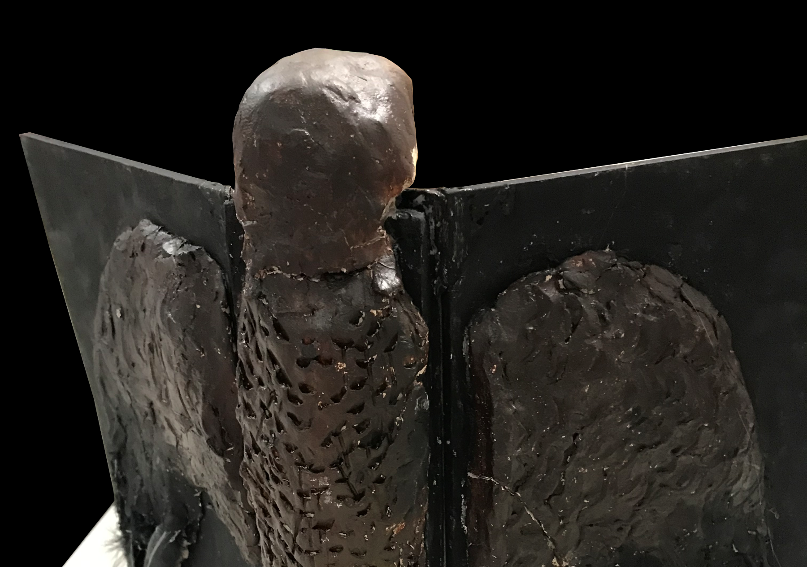
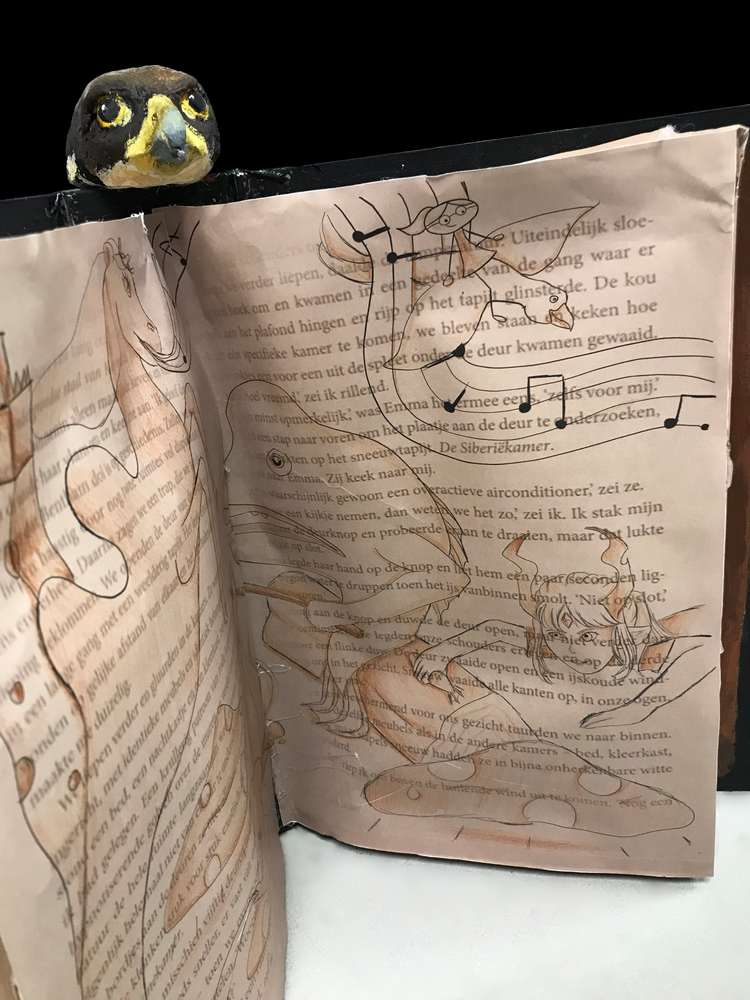

Voor deze opdracht was het de bedoeling dat ik, wie ik was, in een kunstwerk zou uitdrukken. Ik heb ervoor gekozen om een boek te maken met een slechtvalk erop, naar het boek 'De Bijzondere Kinderen Van Mevrouw Peregrine', waar ik op dat moment fan van was. Dit kon meteen symboliseren dat anderen mij meestal een openboek vinden. In het boek heb ik een tekening gemaakt met een toren van Casablanca van kaas. Dat stond voor een muziekalbum die ik destijds altijd luisterde. Er komen dan ook muzieknoten uit de toren. Ook de kameel stond voor deze muziek. Verder zit er een lelijke vis met benen een andere vis te roosteren. Deze vis, de semicossyphus reticulatus, was toen mijn favoriete dier omdat ik hem zo ontzettend lelijk vond. Tot slot heb ik mijn oc's erin verwerkt: een meisje met hoorns die een vis steelt, en een poppetje op een vogel waarvan ik het poppetje al in 2016 tekende. Doordat het een behoorlijk maffe tekening is laat ik zien dat ikzelf ook behoorlijk maf ben.

