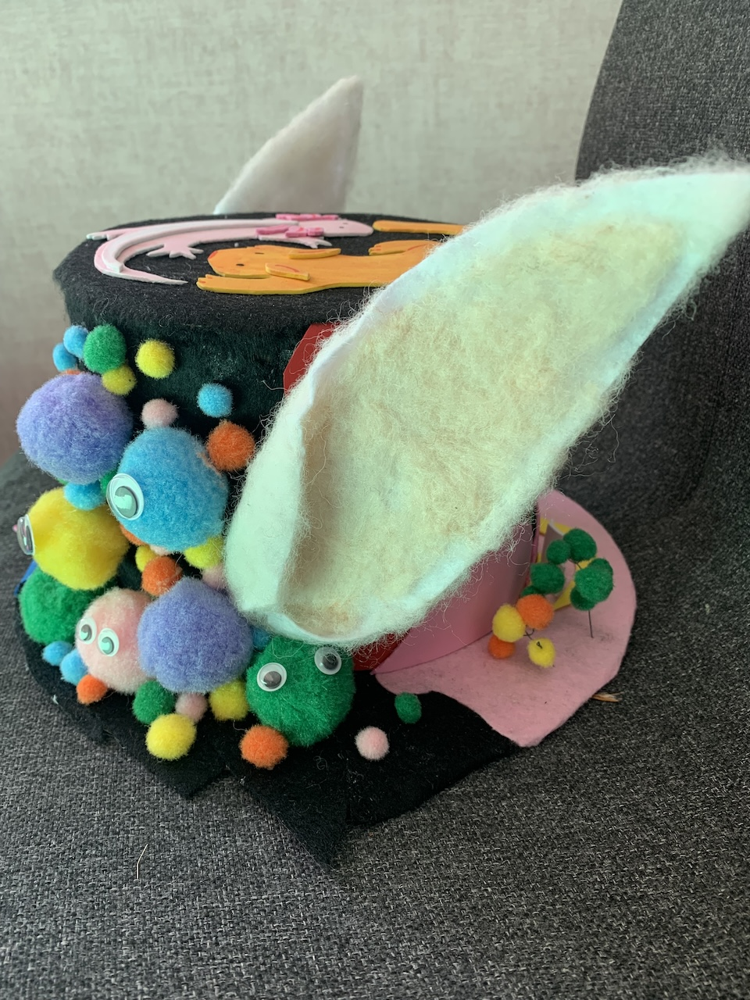
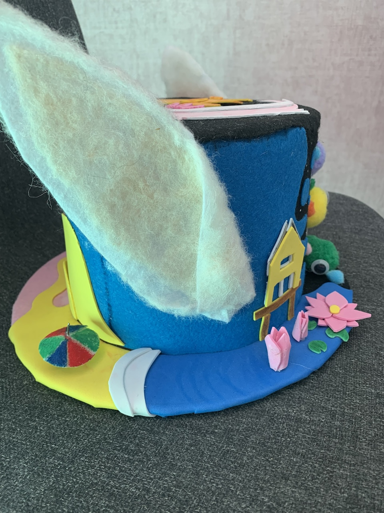
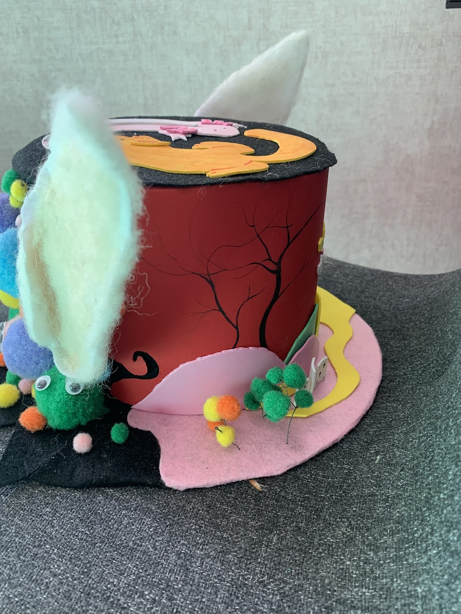

Voor deze schoolopdracht moesten we onze ziel uitdrukken in een kledingsstuk. Dat heb ik gedaan door een hoed te maken waar zoveel mogelijk eigenschappen over mij in terug te lezen zijn. Om er hiervan zoveel mogelijk in te stoppen heb ik geprobeerd symbolische en letterlijke dingen erin te verwerken.

De kleurrijke bollen zijn afgeleid van de eigenschap “bubbly personality”. Het maakt namelijk niet uit wie ik het vraag, maar iedereen die ik ken vind dat ik dat wel heb vanwege mijn vrolijkheid en optimisme. Om het er extra vrolijk uit te laten zien hebben ze ook wiebeloogjes gekregen. Daarmee druk ik gelijk mijn kinderachtige kant uit.

De bollen gaan over in water met waterlelies en mijn huis op de achtergrond. Dit heb ik erbij gedaan omdat ik wel hou van planten en omdat je huis toch wel een belangrijke rol in je leven speelt. Rechtsboven zie je dat het nacht is, dit verwijst naar de indische waterlelies, wat laat zien dat ik sprookjes en verhaaltjes leuk vind.

Het water voor het huis gaat over in de zee, omdat ik hou van warm weer en het strand kalmte uitstraalt en ik zelf ook vaak best kalm ben.

Het strand gaat weer over in een deel dat is gebaseerd op Alice in Wonderland, omdat ik zeker op het moment dat ik het ontworp de griezelige stijl ervan heel mooi vind, ik altijd verdwaal, ik het leuk vind om gek te doen en ik het leuk vind om net als chesire cat op zijn tijd een gezicht te trekken met een enge lach.

Op de top heb ik nog twee diertjes gemaakt waarmee ik mijn vrienden heb uitgedrukt, want mijn beste vrienden zouden dit dier zijn als ze een dier zouden zijn

Tot slot heb ik er konijnenoren op gedaan, aangezien iedereen vind dat ik dat dier zou zijn als ik een dier zou zijn, en dat meteen uitdrukt dat ik veganist ben. Bovendien stond het konijn bij kanjertraining vroeger altijd voor verlegen, en dat ben ik, zeker tegenover leeftijdsgenoten, ook.

Ik heb geprobeerd de achtergrond heel rustig te houden en de ondergrond een beetje donker, maar niet zo donker dat het zwarte gedeelte wegvalt. Het gedeelte waar ik minder trots op ben is nog wel prima te zien, maar ik heb ervoor gezorgd dat deze minder opvalt dan het gedeelte dat ik leuker vind.