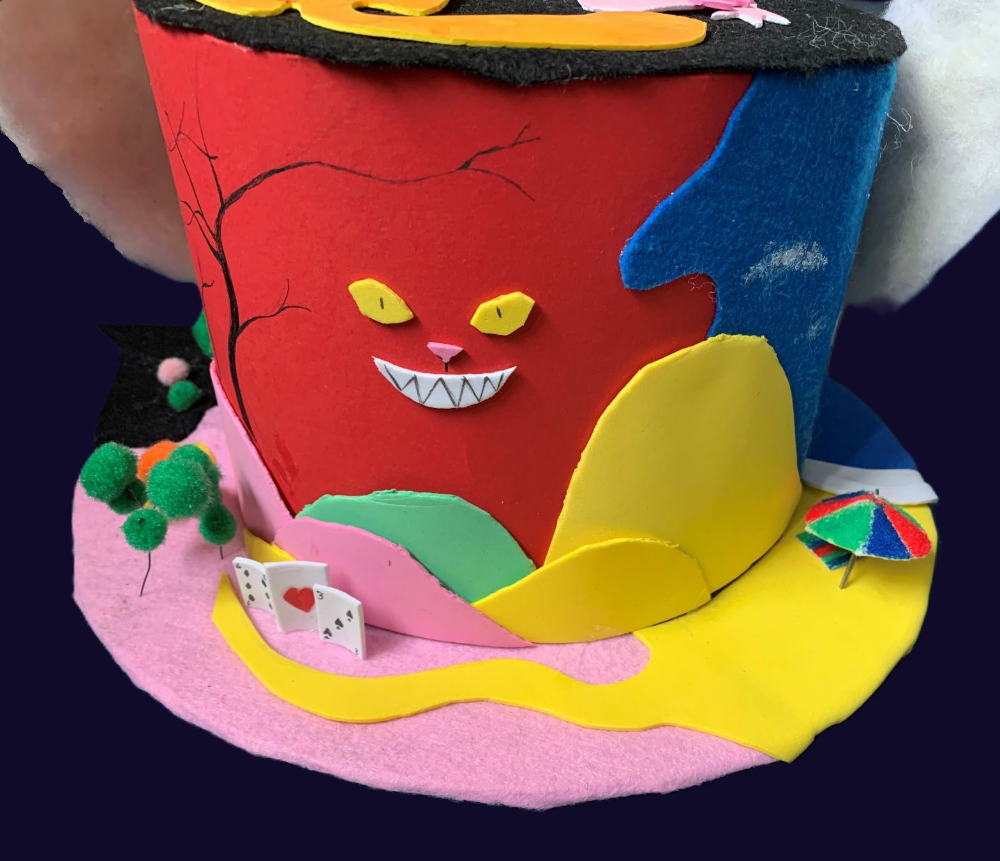
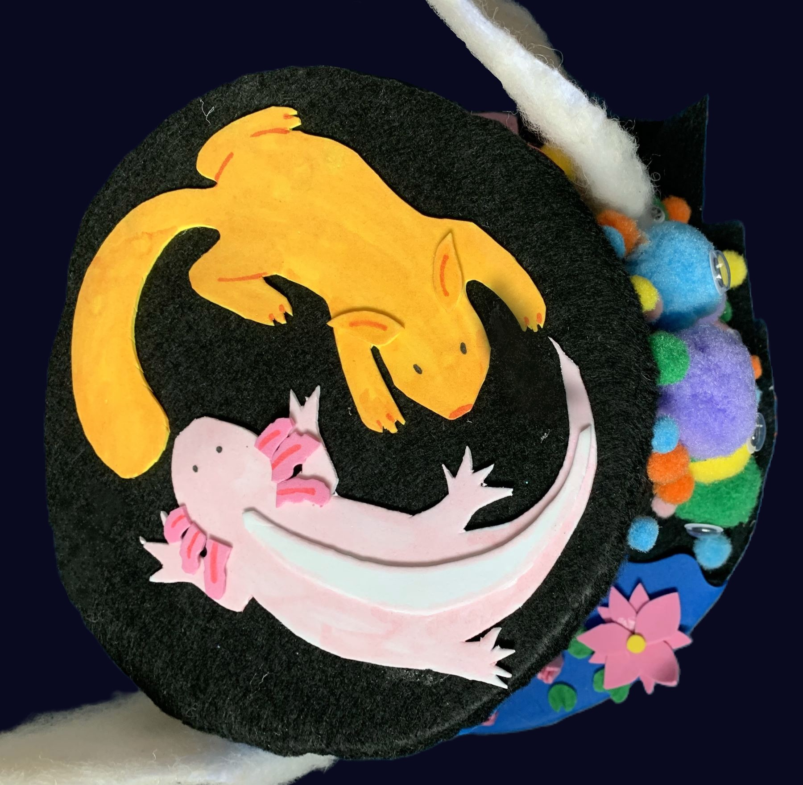

Voor deze schoolopdracht moesten we onze ziel uitdrukken in een kledingsstuk. Dat heb ik gedaan door een hoed te maken waar zoveel mogelijk eigenschappen over mij in terug te lezen zijn. Om er hiervan zoveel mogelijk in te stoppen heb ik geprobeerd symbolische en letterlijke dingen erin te verwerken.

Als eerste zie je een hoop bollen naast een huisje aan het water met waterlelies ervoor. Het huis laat het huis zien waar we wonen, iets wat toch wel een belangrijke rol in je leven speelt. De waterlelies heb ervoor gezet, niet alleen omdat we daadwerkelijk waterlelies voor ons huis hebben, maar ook omdat ik hou van planten en dit verwijst naar het sprookje indische waterlelies. Daarom is het ook nacht met volle maan. Zo laat ik ook zien dat ik sprookjes en verhaaltjes leuk vind.

De kleurrijke bollen zijn afgeleid van de eigenschap “bubbly personality”. Het maakt namelijk niet uit wie ik het vraag, maar iedereen die ik ken vind dat ik dat wel heb vanwege mijn vrolijkheid en optimisme. Om het er extra vrolijk uit te laten zien hebben ze ook wiebeloogjes gekregen. Daarmee druk ik gelijk mijn kinderachtige kant uit.

Het water voor het huis gaat over in de zee. Het strand straalt kalmte uit, wat ik over het algemeen ook wel ben. Bovendien is de zomer mijn favoriete seizoen, en dan gaan we vaak naar het strand.

Het strand gaat weer over in een deel dat is gebaseerd op Alice in Wonderland, omdat ik zeker op het moment dat ik het ontworp de griezelige stijl ervan heel mooi vind, ik altijd verdwaal, ik het leuk vind om gek te doen en ik het leuk vind om net als chesire cat op zijn tijd een gezicht te trekken met een enge lach.

Op de top heb ik nog een axolotl en een eekhoorn gemaakt. Dit moeten mijn twee beste vriendinnen voorstellen. Enkele jaren terug hadden we namelijk gekeken op welk dier we lijken, en onze ideeën daarover zijn behoorlijk hetzelfde gebleven.

Tot slot heb ik er konijnenoren op gedaan, aangezien iedereen vind dat ik dat dier zou zijn als ik een dier zou zijn en dat meteen uitdrukt dat ik veganist ben. Bovendien stond het konijn bij kanjertraining vroeger altijd voor verlegen, en over het algemeen ben ik dat ook best wel erg.

