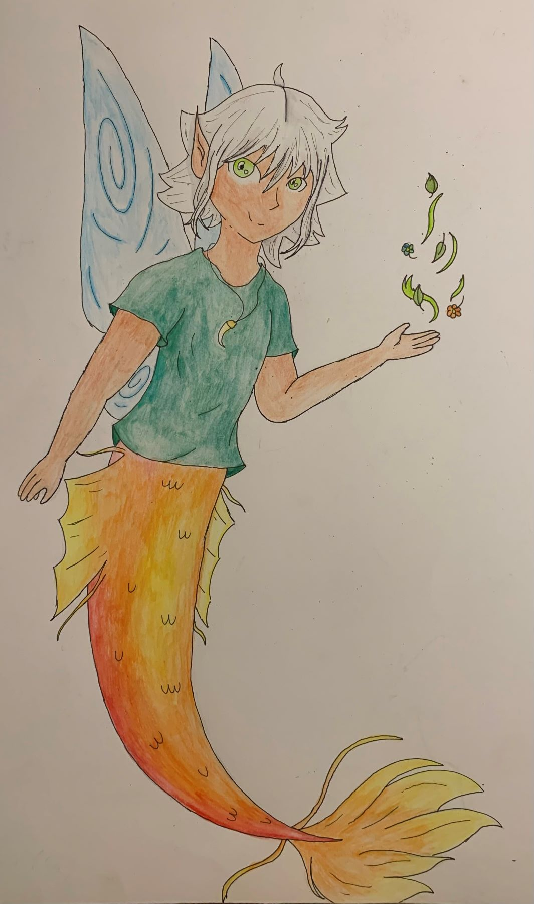

Hier heb ik een karakter die ik vroeger op 11 januari 2020 bedacht heb hertekend. 
Het verhaal dat ik er toen bij bedacht had was dat er vier elementen waren, en de mensen deze allemaal mooi vonden, behalve vuur want daar waren ze bang voor. Het element vuur werd boos, maar dit element was ook de machtigste en de andere elmenten konden hem moeilijk verslaan, dus moesten zij hun krachten bundelen om een wezen te creeëren die net zo machtig was als vuur. Ook omdat ze zelf onmisbaar waren voor het leven op aarde en zelf niet konden vechten. Daaruit ontstond deze creatie die tegen de moeilijkheid liep dat hij op de verkeerde manier die krachten had gekregen: 
-De kracht van water in de benen waardoor hij daar een staart kreeg in plaats van magie.
-Plantenmagie in plaats van dat hij zelf van aarde was en in de grond op kon gaan.
-Vleugels voor lucht die wel goed geplaatst zijn, maar nutteloos aangezien hij ze niet kan gebruiken als ze nat zijn.
Dit verhaal heb ik echter nooit uitgewerkt.

oorspronkelijke tekening
